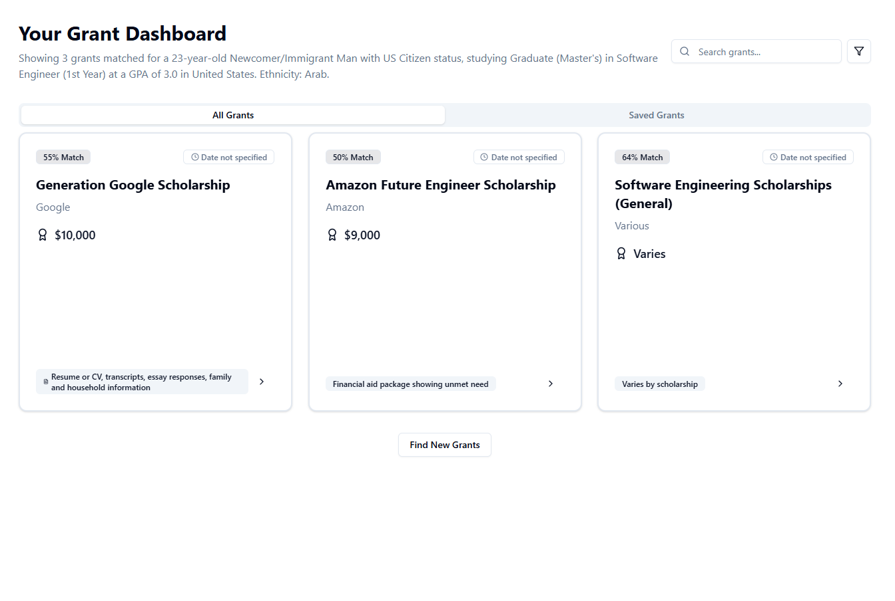

# GrantBridge

**GrantBridge** is a smart web application that helps users discover, understand, and apply to scholarships and grants. It uses the Perplexity Sonar API to break down eligibility, track progress, and generate personalized application drafts.

---

## Screenshots




## Live Demo

Check it out here: [GrantBridge](https://grantbridge.online)

---

## Features

- **Grant Discovery** – AI-powered search to find relevant scholarships based on your profile.
- **Application Assistant** – Understand eligibility criteria and get simplified requirement breakdowns.
- **Checklist Tracker** – Mark off completed requirements as you go.
- **Smart Suggestions** – Get phrase suggestions and application draft support.
- **Saved Grants** – Bookmark opportunities for later.

---

## Tech Stack

**Frontend:**  
React • TypeScript • TailwindCSS • Framer Motion • shadcn/ui • React Helmet Async

**Backend:**  
Node.js • Express • Perplexity Sonar API

**Database:**  
Supabase (PostgreSQL)

**Deployment:**  
- Frontend: AWS S3
- Backend: AWS Lambda
- Database: Supabase Cloud

---

## Architecture & Configuration

### SEO Optimization

GrantBridge is fully optimized for search engines with:

- **Meta Tags** – Dynamic per-page titles, descriptions, and keywords
- **Open Graph & Twitter Cards** – Optimized social media sharing
- **Structured Data (JSON-LD)** – Rich snippets for search results
- **Sitemap & Robots.txt** – Proper search engine crawling

### Server Configuration

**`.htaccess` (Apache Configuration)**

The project includes an `.htaccess` file configured for Apache servers with:

- **SPA Routing** – Redirects all routes to `index.html` for React Router
- **HTTPS Enforcement** – Automatic redirect from HTTP to HTTPS (SEO ranking factor)
- **Gzip Compression** – Reduces file sizes for faster page loads
- **Browser Caching** – Optimizes repeat visits with cache headers
- **Security Headers** – X-Content-Type-Options, X-Frame-Options, XSS-Protection

### Project Structure

```
grantbridge/
├── public/
│   ├── .htaccess          # Apache server configuration
│   ├── robots.txt         # Search engine crawling rules
│   ├── sitemap.xml        # SEO sitemap
│   └── Grantbridge_logo.png
├── src/
│   ├── components/
│   │   ├── SEO.tsx        # Dynamic SEO meta tags
│   │   └── ...
│   └── ...
└── server/                # Backend API
```

---

## Getting Started

### Prerequisites

- Node.js (v18+ recommended)
- pnpm or npm

### Installation

```bash
# Clone the repository
git clone https://github.com/qudahm/grantbridge.git
cd grantbridge

# Install dependencies
pnpm install

# Run development server
pnpm dev
```

---

## Contact

Created by [@qudahm](https://github.com/qudahm) – feel free to reach out!

---

## License

- This project is open source under the MIT License.
